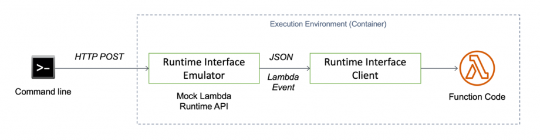
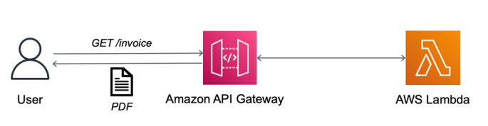

# <u>Lambda functions</u>

A **serverless function** is a piece of code that triggers on certain events (events that you define). For example, uploading data to cloud storage could trigger a serverless function to process that data. It is serverless because you do not provision or manage the server that the code will run on; the cloud provider does it for you. AWS Lambda is Amazon's implementation of serverless functions.

This is the project directory structure for a Lambda function.
```python
my_function_name                    # top-level directory name is your function name
├── lambda_function.py              # contains lambda_handler
├── python_package1                 # Python packages that are required for your lambda handler
├── python_package2
├── python_package3
└── python_packageN
```
* `lambda_function.lambda_handler` is the top-level function; it's like the entrypoint into your application.
* The Python packages are the files and folders in your Python environment `venv/lib/python3.x/site_packages/` or your own custom packages.

`lambda_handler` takes `event` as an argument. `event` is a dictionary-like data structure. Example:
```python
import json

def lambda_handler(event, context):
    print("Received event: " + json.dumps(event, indent=2))
    print("value1 = " + event['key1'])
    print("value2 = " + event['key2'])
    print("value3 = " + event['key3'])
    return event['key1']  # Echo back the first key value
```

When you create a Lambda function, you need to specify some configuration variables:
* MemorySize: this is RAM, and it also influences how much computing power your function is allotted (higher RAM = higher computing power)
* Timeout: this is the maximum time your Lambda function can run (maximum of 15 minutes)
* EphemeralStorage: this is your hard disk size (`/tmp`). If your function needs to store anything, this is where it's stored.
* Policies: permissions attached to the role associated with this function (if your function needs to access other AWS services)

## <u>Runtime dependencies / creating a Lambda function from a zip file</u>

At its simplest, the only file you need to create a Lambda function is `lambda_function.py` (with `lambda_handler`). If you need to include Python packages, you can create a Lambda function from a **zip file**. For example,
* Navigate to `venv/lib/python3.x/site_packages/` and run the command `zip -r9 <dest-folder/dest-file.zip> .`. `-r9` is the highest level of compression.
* Add additional files and folders with `zip -g <dest-file.zip> <file>`, e.g. `<file>` could be `lambda_function.py`. `-g` means "grow".

You can also specify environment variables for your function.

## <u>Creating a Lambda function from a Docker image</u>

Dockerfile format:
```python
FROM public.ecr.aws/lambda/python:3.12          # Base image

WORKDIR ${LAMBDA_TASK_ROOT}                     # /var/task - this is where your application files are stored

COPY requirements.txt .

RUN python -m pip install --upgrade pip \
    && dnf update -y \                          # Previous versions of Lambda used yum for the package manager; new versions use dnf
    && dnf install -y gcc \
    && dnf clean all

RUN pip install --no-cache-dir -r requirements.txt

COPY models ./models
COPY __init__.py .
COPY lambda_function.py .
COPY .env .

CMD [ "lambda_function.lambda_handler" ]
```

Once you build your image, you can push it to AWS ECR and create a Lambda function from the image.

### <u>Locally testing your containerized Lambda function</u>

https://aws.amazon.com/blogs/architecture/field-notes-three-steps-to-port-your-containerized-application-to-aws-lambda/

The runtime interface client expects requests from the Lambda Runtime API, but we don't run the Lambda service when testing locally. We need a way to proxy the Runtime API for local testing, and AWS provides the Lambda runtime interface emulator for this purpose:


The emulator is a lightweight web server running on **port 8080** that converts HTTP requests to Lambda-compatible JSON events.

To run your container, use the command `docker run -p 9000:8080 -e AWS_ACCESS_KEY_ID=<iam-user-access-key> -e AWS_SECRET_ACCESS_KEY=<iam-user-secret-access-key> -e AWS_DEFAULT_REGION=<aws-region> <image-name>`.

To simulate a Lambda request, use `curl`. For example, to `POST` a request, run `curl -X POST "http://localhost:9000/2015-03-31/functions/function/invocations" -H "Content-Type: application/json" -d '{your-json-data}'` or `curl --json '{your-json-data}' "http://localhost:9000/2015-03-31/functions/function/invocations"`.

Lambda Runtime API supports asynchronous handlers, but the emulator does not. That means you need to slightly modify your code for local testing:
```python
import asyncio

async def async_lambda_handler(event, context):
    results = await some-api-call
    return results

def lambda_handler(event, context):
    return asyncio.run(async_lambda_handler(event, context))
```

## <u>Triggers and destinations</u>

The output of your Lambda function can be managed via "Add destination". You can send the output of your Lambda function to another Lambda function; this is useful in time-intensive applications since Lambda functions can only run for maximum 15 minutes. AWS provides something called Step Functions to make this process of chaining Lambda functions easier.

You need to define which events trigger your Lambda function and also where to send the output of your Lambda function (which can be another Lambda function). Lambda functions can only run for 15 minutes, so you may need to chain functions. You can also take a look at AWS Step Functions for this.

### <u>Using API Gateway and local testing</u>

https://aws.amazon.com/blogs/architecture/field-notes-three-steps-to-port-your-containerized-application-to-aws-lambda/



Before, we used nginx and uvicorn to respond to client requests posted to our API endpoint. But we don't have that anymore, so we need the API Gateway. 

For a web application, the trigger of your Lambda function is the API Gateway.

API Gateway with Lambda provides a serverless RESTful web API

rawPath, body, headers

HTTP API, integrate with Lambda
Configure routes: POST, resource path = /chat, integration target = your lambda func
After creation, go to Deploy - Stages - $default - Invoke URL

https://docs.aws.amazon.com/apigateway/latest/developerguide/set-up-lambda-integration-async.html


AWS CLI:
* `aws iam create-role --role-name <role-name> --assume-role-policy-document 'something-here'`
* `aws iam attach-role-policy --role-name <role-name> --policy-arn arn:aws:iam::aws:policy/service-role/AWSLambdaBasicExecutionRole`
* `aws lambda create-function --function-name <function-name> --zip-file <zip-file-name> --handler lambda_function.lambda_handler --runtime python3.10 --role <role-arn>`
* Create Lambda function from ECR image: `aws lambda create-function --function-name <function-name> --package-type Image --code ImageUri=<ecr-image-uri> --role <lambda-role-name>`
* Update Lambda function with new version of ECR image: `aws lambda update-function-code --function-name <lambda-function-name> --region <region> --image-uri <ecr-image-uri>`


# <u>Using the AWS CLI</u>

* `aws iam create-role --role-name lambda-ex-3 --assume-role-policy-document ...`
* `aws iam attach-role-policy --role-name lambda-ex-3 --policy-arn arn:aws:iam::aws:policy/service-role/AWSLambdaBasicExecutionRole`
* `aws lambda create-function --function-name waqas-demo-math-function --zip-file fileb://demo-math-function-package.zip -- handler lambda_function.lambda_handler --runtime python3.10 --role arn:aws:iam::{account_id}:role:lambda-ex-3`
* `aws s3 mb s3://lambda-demo`
* `aws s3 cp resize-image.zip s3://lambda-demo`
* `aws lambda invoke --function demo-math-function --cli-binary-format raw-in-base64-out --payload '{"action": "square, "number": 3}' output.txt`
* `aws 

# <u>AWS API Gateway</u>

You need to define different endpoints in `lambda_function.py`. E.g., you need to define `PREDICT_PATH = /predict` in the file, and the event handling syntax changes: `event['rawPath'] == PREDICT_PATH`.

We'll use HTTP API. Integration with Lambda; pick the Lambda function.

You get an Invoke URL for which you can send your HTTP requests.

# <u>DynamoDB</u>

NoSQL database (JSON format)
AmazonDynamoDBFullAccess
I don't think you can store models on here. This is better for working with datasets. S3 is more like a data lake.