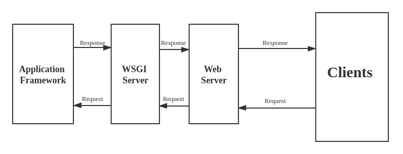

# <u>WSGI</u>

https://www.fullstackpython.com/wsgi-servers.html: A traditional web server does not understand and cannot run Python applications, so the Python community created WSGI - Web Server Gateway Interface - as a standard interface between a traditional web server and the Python application.



**<u>WSGI stack:</u>**
* Web application framework (Flask/Django)
    * Provides the tools and libraries to build the application logic, handle HTTP requests, and generate HTTP responses. This is where you define the endpoints.
    * Implements the WSGI standard, exposing a callable object (often named `app`) that the WSGI server can invoke.
    * Flask example:
        ```python
        from flask import Flask

        app = Flask(__name__)   # app is the WSGI-compliant callable

        @app.route("/")
        def hello():
            return "Hello, World!"
        ```
* WSGI server or gateway (Gunicorn/uWSGI)
    * Bridge between web app and web server. Handles incoming HTTP requests, converting them to a format understood by the WSGI app, and returns responses back to the web server.
    * Web app frameworks are not optimized to handle raw HTTP traffic or efficiently serve multiple requests; that's the purpose of the WSGI server
    * Key functions
        * Parse HTTP requests from the web server
        * Call the WSGI app callable (`app`) and pass request data
        * Return the app response to the web server
* Web server (Apache/Nginx)
    * Handles client-facing tasks like receiving HTTP requests from browsers, handling SSL/TLS encryption, serving static files (images, CSS, JS), and forwarding dynamic requests to the WSGI server
    * Is a reverse proxy and load balancer, which means it's a server that forwards requests from clients to application servers and distributes traffic among multiple servers. It is the entry point for client requests. For example, to handle large volumes of requests, you could have 100 cloud servers running your WSGI app (Flask) and WSGI server (Gunicorn), and 1 cloud server running Nginx to forward HTTP requests to WSGI servers.

**<u>How requests are served:</u>**
1. A client sends an HTTP request to the web server
2. The web server serves static files directly if requested and forwards dynamic requests to the WSGI server
3. The WSGI server receives the request, calls the WSGI app callable, processes the response from the app, and sends it back to the web server
4. The web server forwards the response to the client

**WSGI is a synchronous specification**, which means that both WSGI frameworks and WSGI servers have synchronous program execution. WSGI servers support concurrency via threading and/or multiprocessing.

# <u>ASGI</u>

ASGI - Asynchronous Server Gateway Interface - is the successor to WSGI. The stack is exactly the same, except we replace WSGI frameworks and servers with ASGI frameworks and servers that support asynchronous program execution. ASGI supports both synchronous and asynchronous program execution.
* Web application framework (FastAPI): exactly the same as in WSGI stack except supports asynchronous code
* ASGI server (Uvicorn): manages the event loop for asynchronous web applications. **Enables long-lived connections like WebSockets.**
* Web server (Apache/Nginx): exactly the same as in WSGI stack

**<u>ASGI vs. WSGI:</u>**
|Feature|WSGI|ASGI|
|-------|----|----|
|Default Mode|Synchronous|Asynchronous|
|Concurrency|Threading/Multiprocessing|Event Loop (async/await)|
|Framework Examples|Flask, Django|FastAPI, Starlette|
|Server Examples|Gunicorn, uWSGI|Uvicorn, Hypercorn|
|Features Supported|HTTP requests and responses|HTTP + WebSockets, background tasks, server-sent events, etc.|