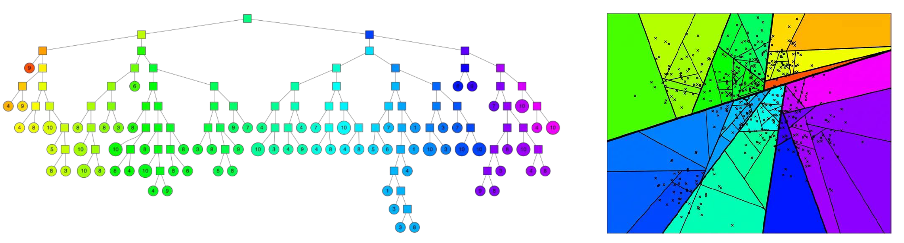
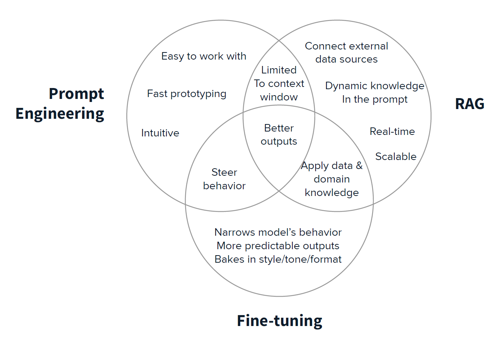

# <u>Motivation for RAG:</u>
* Models hallucinate because they don't know the answer to a question. The knowledge they have depends on their training data; if they don't see it or haven't seen much of it (obscure/rare topics), then they will make stuff up. They aren't sentient; they are simply predicting next token.
* Models have a cutoff date (the date they are trained; the model knows nothing about anything that happens after).
* RAG retrieves the information that the model needs to answer a question and provides that context to the model.
* RAG also allows us to reduce the size of the LLM. Big LLMs are trained to do many different tasks, but an LLM that is fine-tuned specifically to answer questions given some context (usually this means the LLM is instruction-tuned) can be much smaller.

# <u>RAG subsystems</u>

There are 3 RAG subsystems:
* Indexing: Loading, chunking, and embedding your documents and storing the chunks and embeddings into a vector store. The indexing method (how the chunks are stored) affects retrieval.
* Retrieval: Pulling the most relevant chunks from the vector store based on distance metric and indexing method.
* Augmentation: Augmenting the LLM prompt with the retrieved chunks and generating a response.

## <u>Indexing</u>

Indexing steps:
* Load the documents e.g. presentations, PDF, anything. Oftentimes this involves format conversion.
* Chunk the documents - you need to decide how to split up your documents before embedding
    * Fixed chunking - each chunk is same size; not ideal since ideas are not neatly conveyed in same-size chunks
    * NLP chunking - e.g. using regex to detect paragraph boundaries and chunking by paragraph. You can chunk by tokens, words, sentences, paragraphs, pages, etc.
    * Hyperparameters
        * Chunk size - number of tokens/words/sentences/paragraphs/pages per chunk 
        * Chunk overlap - how many tokens/words/sentences/paragraphs/pages to overlap b/w adjacent chunks. Having overlap usually helps with retrieval.
* Embed the chunks - convert the chunks from text or other media to vectors. You can choose to normalize the vectors.
    * OpenAI text embedding model is trained using contrastive learning, where pairs of text are passed to the model. Pairs are either positive (similar) or negative (dissimilar). The pairs are embedded and cosine similarity is calculated for the pair of embeddings. The weights of the model are updated to maximize cosine similarity for positive pairs and minimize cosine similarity for negative pairs.
    * Open source models are available via Hugging Face and the sentence-transformers library
* Store the chunks and the corresponding vectors to a vector store. Vectors require a new kind of DB for fast retrieval (previous DB types: SQL, key-value, document, graph). This step is also when you choose the indexing method, which is the structure for storing and organizing the vectors, and this affects the speed and accuracy of the retrieval (see the retrieval section for indexing methods).

LangChain and LlamaIndex are two frameworks that support indexing a vector DB.

## <u>Retrieval</u>

Retrieval steps:
* Get the user query
* Embed the user query using the same embedding model used for indexing the document chunks
* Vector search (vector store retriever): Find the vectors in the DB that are most similar to the query vector. This search depends on the indexing method and the distance metric chosen for the collection.
    * Most common distance metrics for similarity search
        * Cosine similarity: cosine of the angle between two vectors (normalized dot product)
        * Euclidean distance: distance between two vectors
        * Inner (dot) product: projection of one vector onto the other vector
    * Search methods
        * Exhaustive search - calculating the similarity of embedded query against all vectors in the vector DB - is the most accurate but is extremely slow and not practical for large datasets
        * ANN (approximate nearest neighbors). Reduces search space to speed up search. Construct ANN tree. Split vector space into two, and keep splitting. Then you can search the entire dataset in log time, since the height of the tree is log2(total number of data points). Simply traverse the tree until you hit a leaf, and all vectors in that leaf are the neighbors.
            * You can have multiple trees, e.g. forest of trees. You can aggregate the neighbors from all the trees to get a larger sample size of relevant documents. Then you run cosine similarity on the neighbors against the query.
        * Nearest neighbor search is used in collaborative filtering (recommender systems), semantic search, information retrieval
        * This is also called clustering
        * ANN search libraries
            * FAISS (Facebook AI Similarity Search): indexing, searching, and clustering of dense vectors; GPU support; integrates with PyTorch and TensorFlow
            * Spotify Annoy: C++ library, uses random projection trees
            * Google ScaNN: TensorFlow-based library, uses compression and hashing techniques to speed up search
            * NMSLIB: generic similarity search library. Supports both dense and sparse vectors.
            * HNSWLIB: uses hierarchical graph structure to speed up search and supports both dense and sparse vectors
* Return the `top_k` most similar documents
    

How does indexing affect retrieval? Does it affect retrieval? Yes.
Indexing methods:
* Flat - exhaustive search; compare against all vectors
* **IVFFlat** - IVF stands for inverted file index. Voronoi cells and centroids. Compare against `n_probe` centroids; nearest neighbors are in the selected centroid. Clusters the search space. This is a very popular index for vector DB index and retrieval.
* IVFPQ - PQ stands for product quantization. Reduces the dimension of the distance calculation to reduce the calculation time.
* LSH
* **HNSW** - idea comes from traditional search engines and graph search. Does not require much memory; is fast and accurate.

HNSW and IVFFlat are the most popular index and retrieval techniques.

Trade-off between retrieval accuracy and speed.

## <u>Augment</u>

**<u>Fine-tuning vs. RAG vs. prompt engineering:</u>**
* When you want to modify the behavior to your model to align with a particular style or domain expertise, use fine-tuning. For example, use fine-tuning when you want the model to sound like a medical professional, write in a poetic style, or use the jargon of a specific industry.
* When you want the model to incorporate external knowledge in its responses, use RAG.
* Prompt engineering is a quick and easy way to approximate both fine-tuning and RAG. Since the LLM is instruction-tuned, you can prompt the model to follow, for example, a specific formatting. You can also provide some "external" information in the prompt to enable in-context learning. Prompt engineering is always a good idea whether you use RAG or fine-tuning (or both).

RAG + fine-tuning: In a RAG pipeline, there are two blocks with parameters, the query embedder and the LLM. The search is non-parametric. If you can compare the LLM output against a target, you can backprop through both LLM and query embedder to fine-tune the entire pipeline. What's interesting here is that you can't really update the embeddings in the vector database even though the vector DB embeddings and the query embedding are typically generated using the same embedder.